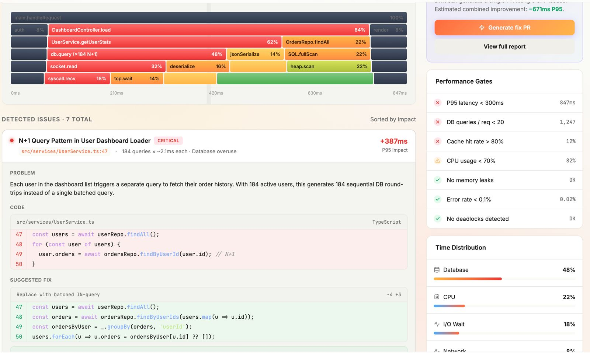
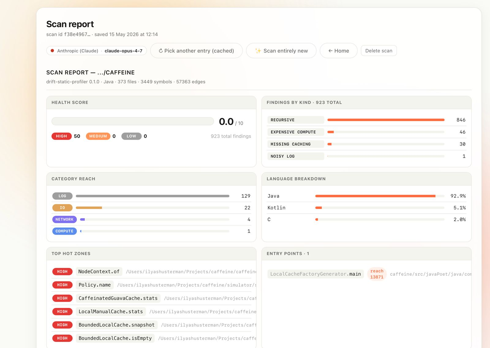
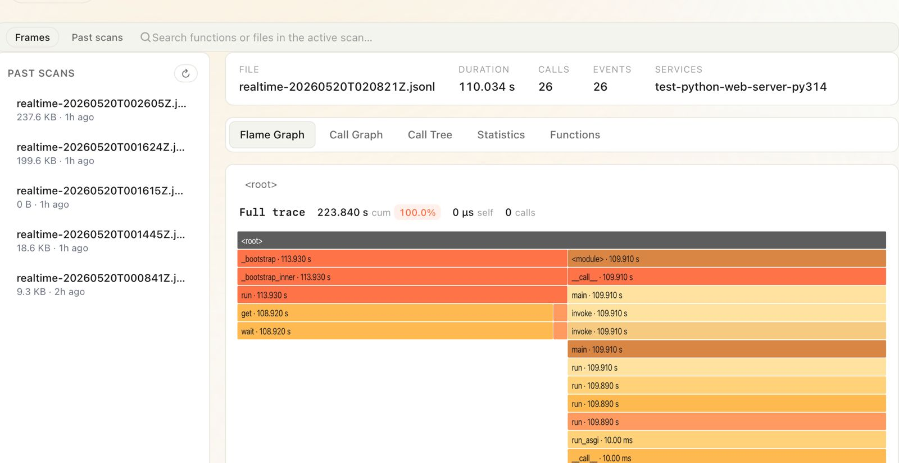
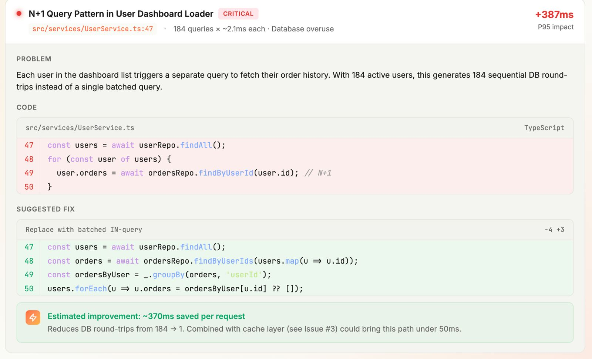
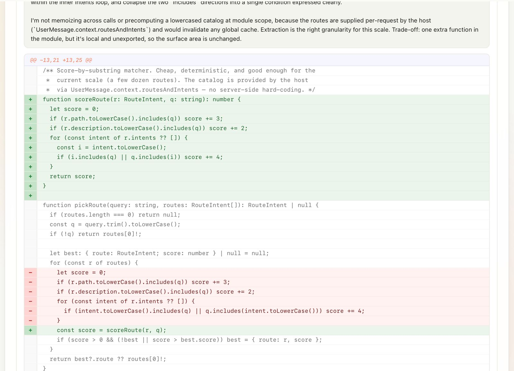

<div align="center">

# Drift

**Find, fix, and prevent performance regressions — before they hit production.**

Open-source performance & FinOps platform: static call-graph analysis +
runtime profiling + per-PR verdicts. One monorepo, five composable surfaces,
zero vendor lock-in.

[](LICENSE)
[](https://github.com/refactorlab/drift/releases?q=drift-lab)
[](https://pypi.org/project/drift-docker-profiler/)



</div>

---

## Why Drift exists

Most performance problems are **discovered in production, paid for in cloud
bills, and fixed under pressure.** Three patterns dominate the bill:

- **N+1 queries** and missing caches that scale linearly with traffic.
- **Recursive / expensive compute** on hot request paths.
- **Blocking I/O in async code** that silently starves workers.

By the time these show up in APM, you're already over-provisioned —
larger DB instances, more app replicas, hotter cache tiers — and the
team is in incident-response mode instead of shipping features.

Drift moves the check **left**: every PR is profiled, every hot path is
inspected statically, every regression is annotated on the diff. The
engineer who introduced the slowdown is the one who fixes it, *while
the context is still fresh* — not the on-call six weeks later.

### The FinOps math

| Where you catch it | Cost to fix (rough) | Cost while it lives in prod |
|---|---|---|
| Editor (lint / static profiler) | minutes | $0 |
| Pull request (Drift verdict) | hours | $0 |
| Staging load test | days | $0 |
| **Production** | **weeks + incident** | **$$$/day in cloud spend + churn** |

A single unchecked N+1 against a 5M-row table on a Tier-2 RDS instance
typically lights up ~$3–8k/month in additional read IOPS plus the
replicas you spin up to absorb the latency. Drift's static profiler
catches that class of issue in seconds, *without running the code*.

---

## What's in this monorepo

Drift is intentionally split into **independent surfaces** so you can adopt
one piece without taking the rest. Every package ships on its own
release cadence and can be used standalone.

```
drift/
├── drift-static-profiler/   Rust  · static call-graph analyzer + viewer
├── drift-observability/     Python + Go · runtime profiler + ingest server
│   ├── drift-profiler-python/   pip package (PyPI: drift-docker-profiler)
│   ├── observability-server/    Go ingest + SSE fan-out
│   └── deploy/                  Helm chart (2 Deployments, 2 Services)
├── drift-lab/               Tauri 2 · macOS/Linux desktop app
├── web-app/                 Hono + React + Postgres · the cloud portal
├── action/  action.yml      GitHub Action — per-PR verdict
└── app/     manifest.yml    GitHub App — zero-touch alternative
```

| Surface | When to reach for it |
|---|---|
| **`drift-static-profiler`** | You want findings on every push without booting infra. Reads source only — no containers, no traffic, no agents. |
| **`drift-profiler-python`** | You're running Python in containers and want sampled wall / CPU flame graphs streamed to a log, file, or Supabase channel. |
| **`drift-observability` server** | You want a small, self-hostable Go service that tails JSONL events and fans out over SSE. |
| **`drift-lab`** | You're an engineer and want a local UI to profile your dev container and browse flame graphs. |
| **`web-app`** | You want the multi-tenant cloud portal — scan history, PR reports, dashboards. |
| **GitHub Action / App** | You want PR-time verdicts and annotations on every change. |

---

## The four ways Drift catches regressions

### 1 · Static call-graph analysis (no execution)

`drift-static-profiler` reads a source tree, builds the symbol-level call
graph, and surfaces findings the moment code is written — Python, Java,
TypeScript, JavaScript, Go, Rust, Scala, Kotlin. No containers, no
traffic, no agent.



For each entry point it produces a structured report: health score,
findings by kind (recursive, expensive compute, missing caching,
noisy log), category reach (DB / Net / IO / Compute), language
breakdown, top hot zones, and refactor candidates. The output is a
single JSON file the viewer (or your CI) consumes.

```bash
cd drift-static-profiler
cargo run --release -- analyze /path/to/repo --entry main > report.json
```

→ See [drift-static-profiler/ARCHITECTURE.md](drift-static-profiler/ARCHITECTURE.md)
for the full pipeline.

### 2 · Runtime profiling (sampling, low overhead)

`drift-docker-profiler` is a wall + CPU stack-sampling profiler for
Python — a surgical fork of [`google-cloud-profiler`](https://github.com/GoogleCloudPlatform/cloud-profiler-python)
with the GCP transport stripped out. Zero runtime deps on the base
install. Drop two lines into your service:

```python
import driftdockerprofiler

driftdockerprofiler.start(service='my-service', service_version='1.0.0')
```

Events stream to a JSONL file, or to Supabase Realtime when the
env vars are set. The companion Go ingest server tails the file and
fans out events over SSE for a live viewer.

→ [drift-observability/drift-profiler-python/README.md](drift-observability/drift-profiler-python/README.md)

### 3 · Local profiling in a desktop app

`drift-lab` is a native Tauri 2 + React + Rust app that profiles
Dockerized services on your laptop and shows live flame graphs, call
trees, statistics, and a past-scan archive.



```bash
cd drift-lab
make setup      # rustup + tauri-cli + icons + npm deps (~5 min)
make            # opens the app with hot reload
```

Or grab a pre-built bundle from
[GitHub Releases](https://github.com/refactorlab/drift/releases?q=drift-lab):
universal `.dmg` for macOS, `.deb` + AppImage for Linux. Auto-updates
via Ed25519-signed releases.

→ [drift-lab/README.md](drift-lab/README.md)

### 4 · Per-PR verdict on GitHub

The GitHub Action (`drift-dev/drift-action@v1`) profiles candidate
builds, compares against the baseline, and posts a check + sticky
comment with annotations on the exact lines that regressed.



```yaml
# .github/workflows/drift.yml
name: Drift
on:
  pull_request:
    types: [opened, synchronize, reopened]

permissions:
  contents: read
  pull-requests: write
  checks: write

jobs:
  drift:
    runs-on: ubuntu-latest
    steps:
      - uses: actions/checkout@v4
        with: { fetch-depth: 0 }
      - uses: drift-dev/drift-action@v1
        with:
          api-token: ${{ secrets.DRIFT_API_TOKEN }}
          profile-command: 'npx drift-profile'
          fail-on: regression
```

Prefer zero-YAML? Install the **GitHub App** at
[github.com/marketplace/drift](https://github.com/marketplace/drift) —
same verdict, runs on Drift cloud, configurable via `.drift.yaml`.

→ [action.yml](action.yml) · [MARKETPLACE.md](MARKETPLACE.md)

---

## Suggested fixes, not just warnings

Drift treats a finding as half the work. Every high-severity issue
ships with a structured suggested fix — the diff the engineer would
have written if they'd seen the problem first.



The suggestions come from two sources:

1. **Pattern-rule rewrites** baked into the static profiler
   (N+1 → batched `IN` query, recursion → memoization, sync I/O in
   async → `asyncio.to_thread`, etc.).
2. **LLM-assisted refactors** for ambiguous cases, gated behind your
   own API key — pluggable, off by default, never exfiltrates source
   without explicit opt-in.

The viewer renders the diff inline so the engineer can copy-paste or
hit the **Generate fix PR** button.

---

## Scaling Drift across an organization

| Org size | Recommended setup |
|---|---|
| Solo / small repo | `drift-lab` desktop app + run `drift-static-profiler` in pre-commit. |
| Single team | Add the GitHub Action; gate merges on `fail-on: regression`. |
| Multi-team org | Install the GitHub App org-wide; deploy `drift-observability` next to your services for production traces; self-host `web-app` for dashboards. |
| Regulated / air-gapped | Run everything locally: static profiler in CI, Python profiler with `JsonlFileSink`, web-app + Postgres on internal infra. Nothing leaves your VPC. |

Every package is **MIT-licensed open source** (the Python profiler is
Apache-2.0 to match upstream). There is no "community vs. enterprise"
edition — the cloud product is convenience, not capability.

### Cost & overhead, by surface

| Surface | Runtime cost | CI cost | Infra |
|---|---|---|---|
| `drift-static-profiler` | none (no execution) | seconds per scan | none |
| `drift-profiler-python` | <2% CPU at default `period_ms=10` | none | optional JSONL volume |
| `drift-observability` server | small Go pod, ~20 MB RSS | none | 1 Deployment + 1 Service |
| `drift-lab` | local only | none | none |
| `web-app` | optional (only for cloud portal) | none | Postgres + Bun runtime |

---

## Quickstart — the whole stack on one laptop

The fastest way to see all pieces talking to each other:

```bash
git clone https://github.com/refactorlab/drift.git
cd drift

# 1. Spin up the cloud portal locally (web-app + Postgres + pgAdmin)
docker compose up --build
# → http://localhost:5000        web app  (login admin@drift.local / 1234)
# → http://localhost:5000/docs   API docs
# → http://localhost:5050        pgAdmin

# 2. Run the static profiler against your own repo
cd drift-static-profiler
cargo run --release -- analyze ~/code/your-repo --entry main

# 3. (Optional) Boot the runtime stack on minikube
cd ../drift-observability
make install && make up
# → http://localhost:8000/docs   FastAPI demo app
# → http://localhost:8080/live   live SSE flame-event viewer

# 4. (Optional) Launch the desktop app
cd ../drift-lab && make setup && make
```

Each subdirectory has its own `README.md` and `Makefile` — `make help`
in any of them lists the targets.

---

## Repository layout in detail

```
drift/
├── README.md                  ← you are here
├── LICENSE                    MIT
├── Makefile                   top-level convenience targets
├── docker-compose.yml         web-app + Postgres + pgAdmin
│
├── drift-static-profiler/     Rust analyzer + Vite/React viewer
│   ├── src/                   tags · graph · roots · tree · insights · report
│   ├── viewer/                React SPA that renders Report JSON
│   ├── tests/                 integration corpus + schema validation
│   ├── ARCHITECTURE.md        file-by-file walkthrough
│   └── INSIGHTS_PLAN.md       finding rules + severity model
│
├── drift-observability/
│   ├── drift-profiler-python/ pip package · PyPI: drift-docker-profiler
│   ├── observability-server/  Go: /ingest, /live_logs (SSE), /docs
│   ├── test-python-web-server/ FastAPI demo wrapped with the profiler
│   ├── deploy/drift-demo/     Helm chart for the 2-Deployment topology
│   └── dev/                   Tiltfile + Makefile entry points
│
├── drift-lab/                 Tauri 2 + React + Rust desktop app
│   ├── desktop-ui/            React + Vite + TS frontend
│   ├── src-tauri/             Rust shell, workflow, docker, db
│   ├── scripts/install-macos.sh  one-line installer for unsigned macOS
│   └── README.md              full dev / build / release guide
│
├── web-app/                   Hono + React + Postgres + Drizzle
│   ├── src/                   Hono API (auth, scans, reports)
│   ├── web/                   React SPA
│   ├── drizzle/               migrations
│   └── api/                   serverless entry (Vercel-compatible)
│
├── action/                    GitHub Action source (composite + Node 20)
├── action.yml                 marketplace manifest
├── app/manifest.yml           GitHub App manifest (one-click install)
├── examples/drift.yml         example consumer workflow
└── docs/                      screenshots used in this README
```

---

## Documentation index

| Doc | What it covers |
|---|---|
| [drift-static-profiler/ARCHITECTURE.md](drift-static-profiler/ARCHITECTURE.md) | Full pipeline, file-by-file, including the insight passes |
| [drift-static-profiler/INSIGHTS_PLAN.md](drift-static-profiler/INSIGHTS_PLAN.md) | Finding rules, severity model, calibration data |
| [drift-static-profiler/CALIBRATION.md](drift-static-profiler/CALIBRATION.md) | How thresholds were chosen, OSS corpus methodology |
| [drift-lab/README.md](drift-lab/README.md) | Dev loop, install scripts, auto-update, signing |
| [drift-lab/UPDATER.md](drift-lab/UPDATER.md) | Ed25519 release-signing flow |
| [drift-observability/README.md](drift-observability/README.md) | Two-Deployment topology, event format, trim controls |
| [drift-observability/drift-profiler-python/README.md](drift-observability/drift-profiler-python/README.md) | Python agent — sinks, sampling, exclude paths |
| [MARKETPLACE.md](MARKETPLACE.md) | GitHub Action + App install & config reference |

---

## License

- **MIT** for the monorepo (see [LICENSE](LICENSE)).
- **Apache-2.0** for `drift-profiler-python` to match its upstream
  (Google Cloud Profiler).

You can self-host any combination of these components — no telemetry,
no API key required for the open-source paths.

---

## About Refactor Labs

Drift is built by **[Refactor Labs](https://refactorlab.com)** —
production observability tooling for engineering teams that ship fast.
We open-source the agents and analyzers so you can audit them, run them
without us, and ship their output anywhere.

Found a bug? Have a feature request?
[Open an issue](https://github.com/refactorlab/drift/issues).
