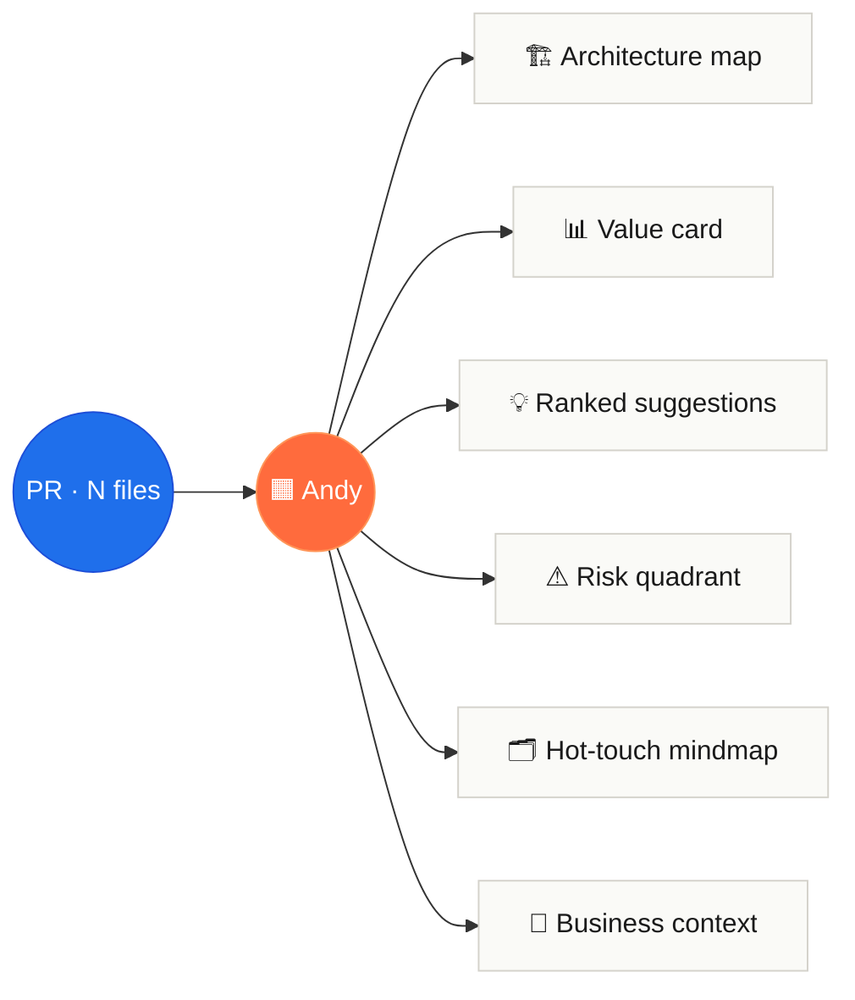

<p align="center">
  <a href="https://refactorlab.github.io/andy/">
    
  </a>
</p>

<h1 align="center">Andy &nbsp;·&nbsp; PR Handoff Assistant</h1>

<p align="center">
  <strong>The PR review that explains <em>what actually changed</em>.</strong><br/>
  A GitHub Action. One comment. Zero services to authorize.
</p>

<p align="center">
  <a href="https://github.com/marketplace/actions/andy-pr-handoff-by-drift">
    
  </a>
  <a href="https://refactorlab.github.io/andy/">
    
  </a>
  <a href="./LICENSE">
    
  </a>
  <a href="https://refactorlab.github.io/andy/pr36-github-ui_2.html">
    
  </a>
</p>

<p align="center">
  <sub>
    <code>~30s</code> per PR &nbsp;·&nbsp; <code>$0</code> service cost &nbsp;·&nbsp; <code>1</code> YAML file to install &nbsp;·&nbsp; runs on your own runner
  </sub>
</p>

<p align="center">
  <picture>
    <source media="(prefers-color-scheme: dark)" srcset="https://raw.githubusercontent.com/refactorlab/andy/main/docs/screenshots/hero-dark.png" />
    
  </picture>
</p>

---

## Table of contents

- [Why Andy](#why-andy)
- [Install — one YAML file](#install--one-yaml-file)
- [Anatomy of the comment](#anatomy-of-the-comment)
- [A peek at the output](#a-peek-at-the-output)
- [On a real PR](#on-a-real-pr)
- [How it works](#how-it-works)
- [Configuration](#configuration)
- [What Andy doesn't do](#what-andy-doesnt-do)
- [The landing page is part of the action](#the-landing-page-is-part-of-the-action)
- [Local development & reproducible screenshots](#local-development--reproducible-screenshots)
- [Repository layout](#repository-layout)
- [CI / CD](#ci--cd)
- [License & contact](#license--contact)

---

## Why Andy

Three questions every PR comment fails to answer:

<table>
<tr>
<td width="33%" valign="top">
<sub><strong>01</strong></sub>
<h3>"LGTM"</h3>
<sub>Reviewers approve PRs they didn't fully understand because nobody has 90 minutes to trace a 100-file diff. Bugs ship in the gap between <em>looks right</em> and <em>is right</em>.</sub>
</td>
<td width="33%" valign="top">
<sub><strong>02</strong></sub>
<h3>Why does this exist?</h3>
<sub>Context lives in Linear, Slack threads, and the author's head — not in the PR. New reviewers spend half their time inferring intent before they can judge the code.</sub>
</td>
<td width="33%" valign="top">
<sub><strong>03</strong></sub>
<h3>What did it cost?</h3>
<sub>No one can answer in dollars or minutes. The PR closes, the impact disappears into vibes, and the team forgets what they shipped by next quarter.</sub>
</td>
</tr>
</table>

Andy reads every pull request and posts **one comment** with the answers.

---

## Install — one YAML file

Drop this into `.github/workflows/drift.yml`. No tokens, no profile commands, no extra config.

```yaml
name: Drift
on:
  pull_request:
    types: [opened, synchronize, reopened]

permissions:
  contents: read
  pull-requests: write
  checks: write
  models: read

jobs:
  drift:
    runs-on: ubuntu-latest
    steps:
      - uses: actions/checkout@v4
        with: { fetch-depth: 0 }
      - uses: refactorlab/drift@main
```

Then open a PR — Andy auto-detects the latest profiler release, caches it via `$RUNNER_TOOL_CACHE`, and posts a sticky comment within ~30 seconds.

<p align="center">
  <picture>
    <source media="(prefers-color-scheme: dark)" srcset="https://raw.githubusercontent.com/refactorlab/andy/main/docs/screenshots/install-dark.png" />
    
  </picture>
</p>

<details>
<summary>👉 <strong>The YAML, close up</strong></summary>

<p align="center">
  
</p>

</details>

---

## Anatomy of the comment



One sticky comment per pull request, re-rendered on every push. Inside it: the visuals that turn a large diff into a guided handoff, plus the code suggestions and risks that actually need a reviewer's eye.

<p align="center">
  <picture>
    <source media="(prefers-color-scheme: dark)" srcset="https://raw.githubusercontent.com/refactorlab/andy/main/docs/screenshots/bento-dark.png" />
    
  </picture>
</p>

| # | Artifact | What it is |
|:-:|---|---|
| 1 | 🏗 **Architecture map** | Before → after diagrams of what your PR changed, plus the data structures connecting the two. Rendered as Mermaid. |
| 2 | 📊 **Value card** | Money, customer, runtime, runtime-UX — each scored with the formula, the inputs that produced it, and a confidence label. |
| 3 | 💡 **Ranked suggestions** | Every code suggestion ships with a confidence score, a category, an applyable diff, and references to specs or docs. |
| 4 | ⚠️ **Risk quadrant** | Severity × likelihood map of every risk Andy spotted. Block on what's red before merge; monitor the rest. |
| 5 | 🗂 **Hot-touch mindmap** | The files reviewers should open first, grouped by subsystem — the difference between a 100-file PR and a 6-file mental model. |
| 6 | 🧭 **Business context** | A product-level diagram with the slice your PR touches highlighted — so reviewers see *why* the change exists, not just *what*. |

---

## A peek at the output

Two artifacts from a real review on a 100-file PR — the value card, a ranked product-correctness suggestion with a fixable diff, and the self-drawing architecture map underneath:

<p align="center">
  <picture>
    <source media="(prefers-color-scheme: dark)" srcset="https://raw.githubusercontent.com/refactorlab/andy/main/docs/screenshots/example-dark.png" />
    
  </picture>
</p>

<table>
<tr>
<td width="50%" valign="top">

#### The preview card


</td>
<td width="50%" valign="top">

#### The architecture map


</td>
</tr>
</table>

📎 [**Open the full example review →**](https://refactorlab.github.io/andy/pr36-github-ui_2.html)

---

## On a real PR

This is exactly what reviewers see when Andy lands on a real pull request (`refactorlab/drift#36`) — the sticky comment with a live architecture flow, weighted scores, and grouped findings:

<p align="center">
  
</p>

---

## How it works

1. **Runs as a GitHub Action on your own runner.** Nothing leaves the workflow — no service to authorize, no API key to manage.
2. **Auto-detects the latest profiler release** (`drift-static-profiler`) and caches it via `$RUNNER_TOOL_CACHE` so subsequent runs are fast.
3. **Walks the PR diff** against the base branch, builds the call graph + data-structure map, and renders the comment.
4. **Posts (or updates) a single sticky comment** — identified by a hidden marker, so it's overwritten in place on every push.
5. **Adds a `Drift / PR review` check run** summarising the verdict (advisory; does not fail the check).

---

## Configuration

Andy works with **zero configuration** — just paste the YAML above.

<details>
<summary>🔑 <strong>Permissions explained</strong></summary>

| Permission | Why |
|---|---|
| `contents: read` | Read the diff and the base/head trees. |
| `pull-requests: write` | Create / update the sticky comment. |
| `checks: write` | Emit the `Drift / PR review` check run. |
| `models: read` | Read GitHub Models for LLM-assisted suggestion ranking. |

</details>

<details>
<summary>⚙️ <strong>Optional knobs</strong> (env or with-block)</summary>

| Variable | Default | Notes |
|---|---|---|
| `DRIFT_BASE_SHA` | inferred | Override the base SHA Andy diffs against. |
| `DRIFT_SUGGESTION_CONFIDENCE` | `0.75` | Floor for showing a code suggestion. |
| `DRIFT_DEV_HOUR_RATE_USD` | `95` | Used in the Money axis formula. |

</details>

---

## What Andy doesn't do

<details>
<summary>👉 <strong>Click for the honesty section</strong></summary>

- ❌ **Doesn't block merges.** Findings surface as a check-run *summary*; you decide whether to gate on them.
- ❌ **Doesn't run your tests, or your code.** Pure static analysis on the diff + call graph.
- ❌ **Doesn't talk to any external service** beyond GitHub APIs. The whole pipeline runs on your runner.
- ❌ **Doesn't model new-feature dev time.** The Money axis is the cost of *servicing* what the PR ships (bugs + maintenance + LLM iteration) — not the cost of building it.
- ❌ **Doesn't replace human review.** It hands the next reviewer a guided map and a short list of things that warrant a second look.

</details>

---

## The landing page is part of the action

The page at **<https://refactorlab.github.io/andy/>** is shipped from this repo, and it's *also* a deliberate showcase of modern frontend craft — the kind of thing the action's reviewers care about. A few highlights from the implementation:

- **OKLCH color** for perceptually-uniform gradients, with an sRGB fallback
- A **bento layout** with CSS Grid + **container queries**, so the featured cell adapts to its own width
- A **fluid `clamp()` type & space scale** — no breakpoint jumps between mobile and desktop
- Native `<dialog>` + `@starting-style` + `transition-behavior: allow-discrete` for the command palette's entry/exit
- A **WebGL2 shader** background (OKLCH FBM mesh), a **self-drawing SVG architecture diagram**, **CSS Motion Path** data-flow particles, a **self-typing syntax-highlighted YAML**, **kinetic variable-font** typography, a **spring-physics cursor** — all `prefers-reduced-motion`-aware
- An **adaptive `perf-lite` mode** that drops the heaviest layers on weak devices (Save-Data, ≤2 GB RAM, ≤2 cores)
- **React.lazy code-splitting** moves decorative components off the critical path
- **JSON-LD structured data**, an installable **web app manifest**, **Speculation Rules** prefetch, a **skip link**, an **`sr-only`** utility, and **CSS logical properties** for RTL readiness

Press **⌘K / Ctrl+K** anywhere on the page to open the command palette — fuzzy filter, full keyboard control, with theme/perf/section commands:

<p align="center">
  <picture>
    <source media="(prefers-color-scheme: dark)" srcset="https://raw.githubusercontent.com/refactorlab/andy/main/docs/screenshots/palette-dark.png" />
    
  </picture>
</p>

<sub>There's also a hidden treat — try the Konami code: <kbd>↑</kbd><kbd>↑</kbd><kbd>↓</kbd><kbd>↓</kbd><kbd>←</kbd><kbd>→</kbd><kbd>←</kbd><kbd>→</kbd><kbd>B</kbd><kbd>A</kbd>.</sub>

---

## Local development & reproducible screenshots

Requires [Bun](https://bun.com) ≥ 1.3.

```sh
bun install
bun run dev          # local dev server at http://localhost:5173/andy/
bun run typecheck    # tsc -b --noEmit
bun run test         # bun:test — pure-logic suite (yaml tokenizer, scramble, konami, perf)
bun run build        # production build into dist/
bun run preview      # preview the production build
```

Every screenshot in this README is generated by [`scripts/screenshots.ts`](./scripts/screenshots.ts) — a small Chrome DevTools Protocol driver. To regenerate them:

```sh
# 1) Start the dev server
bun run dev
# 2) In another shell, launch headless Chrome on a debug port
"/Applications/Google Chrome.app/Contents/MacOS/Google Chrome" \
  --headless=new --disable-gpu --remote-debugging-port=9333 \
  --user-data-dir=/tmp/andy-chrome about:blank &
# 3) Capture every shot in docs/screenshots/  (light + dark + close-ups)
bun scripts/screenshots.ts 5174 9333
```

The script writes the theme into `localStorage` before navigation so the page's no-FOUC bootstrap picks it up, emulates `prefers-reduced-motion: reduce` for deterministic captures, and uses CDP's `captureScreenshot` `clip` parameter to crop close-ups precisely to an element's bounding box.

---

## Repository layout

```
public/pr36-github-ui_2.html       # the full example review the landing page links to
public/manifest.webmanifest        # PWA manifest (theme-color, icons, installable)
src/components/                    # React components (Hero, Bento, palette, …)
src/lib/                           # pure logic (yaml tokenizer, scramble, perf, theme store)
src/lib/*.test.ts                  # bun:test unit suite (20 tests, 41 expects)
scripts/screenshots.ts             # CDP-driven screenshot generator
docs/banner.svg                    # the SVG banner at the top of this README
docs/screenshots/                  # 15 PNGs — light, dark, and component close-ups
.github/workflows/ci.yml           # type-check + tests + build on every PR
.github/workflows/deploy.yml       # GitHub Pages deploy pipeline
.github/workflows/drift.yml        # Andy PR review (dogfoods the action on this repo)
```

---

## CI / CD

Three workflows in [`.github/workflows/`](./.github/workflows):

- **`ci.yml`** — type-checks (`tsc -b --noEmit`), runs the `bun test` suite, and builds the landing page on every PR.
- **`drift.yml`** — runs Andy on this repo's own PRs. The action **dogfoods itself**.
- **`deploy.yml`** — on push to `main`, builds (`vite build`, base `/andy/`) and deploys `dist/` to GitHub Pages.

The first time you deploy, enable Pages under **Settings → Pages → Source → GitHub Actions**.

---

## License & contact

- **Marketplace:** <https://github.com/marketplace/actions/andy-pr-handoff-by-drift>
- **Issues:** <https://github.com/refactorlab/andy/issues>
- **Contact:** [schuldi@gmail.com](mailto:schuldi@gmail.com)
- **License:** [MIT](./LICENSE)

---

<p align="center">
  <sub>
    © <a href="https://github.com/refactorlab">Refactor Labs</a> · built to make code review feel less like archaeology.
  </sub>
</p>
