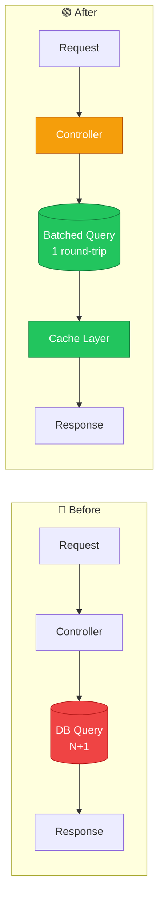
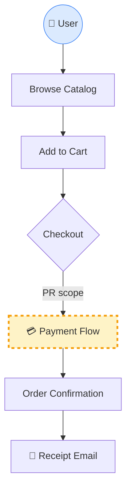
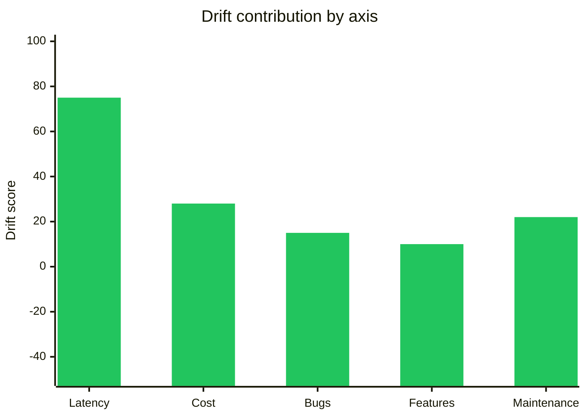
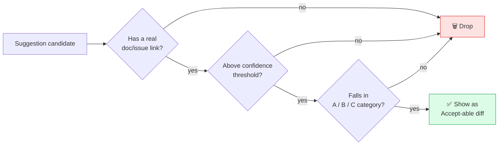

You must implement the following spec:

# PR Review System — Visual Spec

> Generate **3 images + code suggestions** for every PR.
> Goal: a reviewer should understand *why*, *what*, and *how much it costs* in under 60 seconds.

---

## Context & Reasoning (Chain of Thought)

Developers today rely on Miro / Figma / Eraser to explain architecture changes, but those tools live **outside** the PR. The reviewer has to context-switch. Senior reviewers always read top-down: **why → high-level → low-level → numbers → suggestions**.

This spec produces that reading order automatically, as part of the PR itself.

| Image | What it answers | Audience |
|-------|-----------------|----------|
| **#1 Architecture Flow** | *What changed in the call graph?* (before vs after) | Engineers reviewing low-level code |
| **#2 High-Level Business Logic** | *Why does this change exist? What's the product context?* | Tech leads, PMs, cross-team reviewers |
| **#3 Business Value Report** | *Is it worth merging? Time + money + value drift* | Engineering managers, decision makers |
| **Code Suggestions** | *Concrete refactors the reviewer can `Accept` in one click* | Author of the PR |

---

## Image 1 — Architecture Flow (Before vs After)

**Purpose:** visual diff of the call graph. A picture is worth a thousand words.

**Rules:**
- Mermaid `flowchart LR` for left-to-right comparison.
- Color code: 🟦 unchanged, 🟩 added, 🟥 removed, 🟧 modified.
- Show the **data structures** flowing between nodes (they're the spine of the change).



**Data structures involved:**

| Structure | Direction | Notes |
|-----------|-----------|-------|
| `UserRequest` | in | unchanged |
| `QueryBatch[]` | new | replaces single-row fetches |
| `CacheEntry<User>` | new | TTL = 300s |
| `Response` | out | shape unchanged |

---

## Image 2 — High-Level Business Logic

**Purpose:** answer *"why does this PR exist at all?"* before diving into code.

**Rules:**
- Mermaid `flowchart TD` (top-down — matches how humans read product flows).
- Use **product nouns**, not class names. (`Checkout`, not `CheckoutServiceImpl`.)
- Mark the **slice** this PR touches with a dashed box.



**Summary of change (one paragraph max):**
> Payment flow now retries idempotent calls up to 3× with exponential backoff. Removes a known failure mode where transient gateway 503s caused users to be charged but see an error screen.

---

## Image 3 — Business Value Report (RFC-style card)

**Purpose:** a GitHub-style stats card, but instead of "contributors" and "commits" it shows **value** (features / bugs / cost / runtime drift).

**Rules:**
- Render as a markdown table inside a fenced block so it copies cleanly.
- Always show **estimate ± confidence**. Never bare numbers.
- "Drift" is a standard score from -100 (regression) → +100 (improvement).

### 📊 PR Value Card

| Metric | Before | After | Δ Drift | Confidence |
|--------|-------:|------:|--------:|:----------:|
| ⏱  **p95 latency** | 840 ms | 210 ms | **+75** 🟢 | high |
| 💰 **Infra cost / mo** | $1,240 | $890 | **+28** 🟢 | medium |
| 🐛 **Open bugs closed** | — | 2 | **+15** 🟢 | high |
| ✨ **Features shipped** | — | 1 | **+10** 🟢 | high |
| 🔧 **Maintenance hrs / mo** | 6 h | 2 h | **+22** 🟢 | medium |
| **Overall PR drift** | | | **+38** | medium |



> **Estimated $ impact:** ~$4,200 / year saved + ~48 dev-hours / year reclaimed.
> Numbers come from production telemetry (last 30 days) + standard cost-of-engineering rate.

---

## Code Suggestions (LLM-generated, threshold-gated)

**Rules:**
- Only emit a suggestion if confidence > **threshold (default 0.75)**.
- Every suggestion must include a **real documentation link** or a **known-issue link**.
- Categorize: 🅐 optimization (N+1, hot loops), 🅑 product correctness, 🅒 framework misuse.
- Format as GitHub `suggestion` blocks so the author can click **Accept**.

### Example: 🅐 Optimization — N+1 query

**File:** `src/users/service.py` · **Line:** 42 · **Confidence:** 0.91
**Why it matters:** classic N+1 — one query per user × 200 users on the dashboard endpoint.
**Reference:** [SQLAlchemy — `selectinload` docs](https://docs.sqlalchemy.org/en/20/orm/queryguide/relationships.html#selectin-eager-loading)

````diff
```suggestion
- users = session.query(User).all()
- for u in users:
-     u.orders  # triggers a query per user
+ users = (
+     session.query(User)
+     .options(selectinload(User.orders))
+     .all()
+ )
```
````

### Example: 🅑 Product correctness — silent failure

**File:** `src/payments/retry.py` · **Line:** 87 · **Confidence:** 0.82
**Why it matters:** `except Exception: pass` swallows the gateway error you specifically added retry logic for. Defeats the purpose of the PR.
**Reference:** [Known issue #4421 — silent payment swallow](https://example.com/issues/4421)

````diff
```suggestion
- except Exception:
-     pass
+ except GatewayTimeoutError as e:
+     logger.warning("retrying payment", extra={"err": str(e)})
+     raise
```
````

### Example: 🅒 Framework misuse — numpy for a 5-element list

**File:** `src/metrics/agg.py` · **Line:** 14 · **Confidence:** 0.78
**Why it matters:** `numpy.mean` on a 5-item Python list costs ~12µs of import + dispatch overhead. Python builtin is ~0.4µs and removes the dep.
**Reference:** [Python `statistics.mean` — when to prefer it](https://docs.python.org/3/library/statistics.html#statistics.mean)

````diff
```suggestion
- import numpy as np
- avg = np.mean(scores)
+ avg = sum(scores) / len(scores)
```
````

---

## Suggestion Quality Bar (senior-dev test)

A suggestion is only worth showing if it passes **all three**:



If zero suggestions clear the bar, **show nothing** — silence is better than noise for senior devs.

---

## Output Order in the PR Comment

1. **Image 1** — architecture flow (call graph diff)
2. **Image 2** — high-level business logic (product context)
3. **Image 3** — value card (time + money + drift)
4. **Code suggestions** — only the ones above threshold, each with `Accept` button

Top-down: *what changed → why → is it worth it → here's the fix.*
