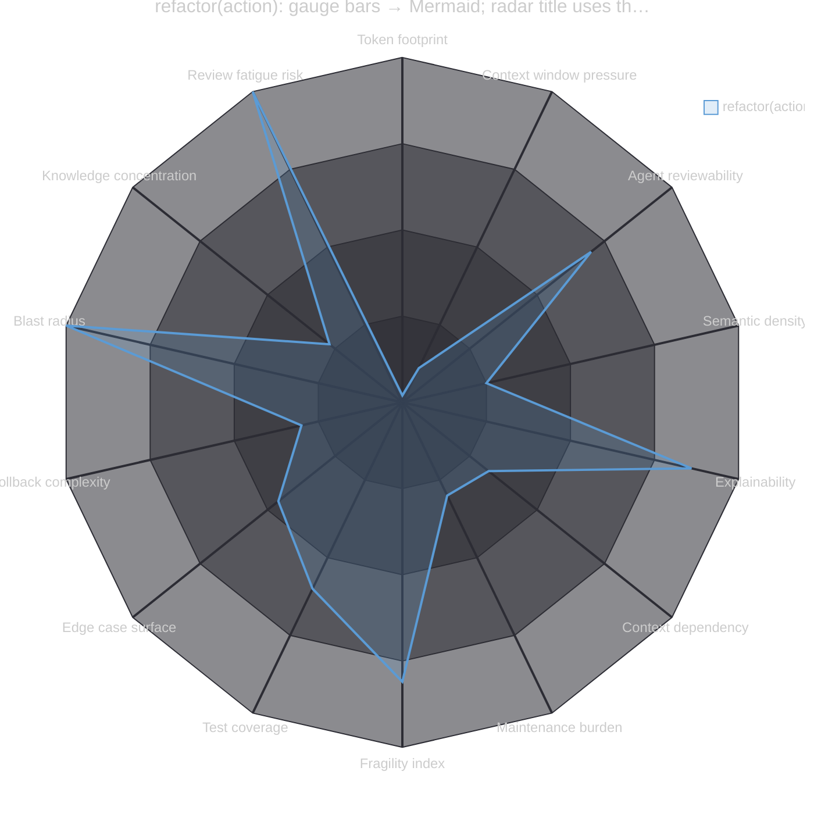
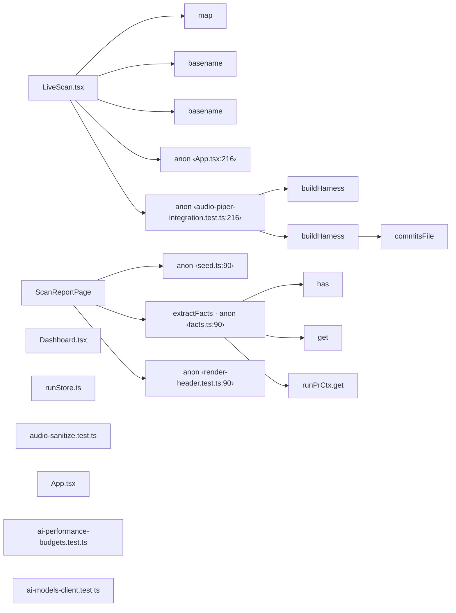

<!-- drift:sticky-comment -->
<p></p>

<p align="center">  </p>

<table>
<tr>
<td align="center"><picture><source media="(prefers-color-scheme: dark)" srcset="https://quickchart.io/chart?w=260&h=240&bkg=transparent&c=%7B%22type%22%3A%22radialGauge%22%2C%22data%22%3A%7B%22datasets%22%3A%5B%7B%22data%22%3A%5B0%5D%2C%22backgroundColor%22%3A%22%23ff7b6b%22%7D%5D%7D%2C%22options%22%3A%7B%22domain%22%3A%5B0%2C100%5D%2C%22trackColor%22%3A%22%232d333b%22%2C%22roundedCorners%22%3Atrue%2C%22centerPercentage%22%3A82%2C%22centerArea%22%3A%7B%22text%22%3A%220%2F5%22%2C%22fontColor%22%3A%22%23ff7b6b%22%2C%22fontSize%22%3A40%7D%2C%22title%22%3A%7B%22display%22%3Atrue%2C%22text%22%3A%22MERGE%20CONFIDENCE%22%2C%22fontColor%22%3A%22%239aa5b1%22%2C%22fontSize%22%3A13%2C%22fontStyle%22%3A%22bold%22%7D%7D%7D"></picture></td>
<td align="center"><picture><source media="(prefers-color-scheme: dark)" srcset="https://quickchart.io/chart?w=260&h=240&bkg=transparent&c=%7B%22type%22%3A%22radialGauge%22%2C%22data%22%3A%7B%22datasets%22%3A%5B%7B%22data%22%3A%5B100%5D%2C%22backgroundColor%22%3A%22%23ff7b6b%22%7D%5D%7D%2C%22options%22%3A%7B%22domain%22%3A%5B0%2C100%5D%2C%22trackColor%22%3A%22%232d333b%22%2C%22roundedCorners%22%3Atrue%2C%22centerPercentage%22%3A82%2C%22centerArea%22%3A%7B%22text%22%3A%225%2F5%22%2C%22fontColor%22%3A%22%23ff7b6b%22%2C%22fontSize%22%3A40%7D%2C%22title%22%3A%7B%22display%22%3Atrue%2C%22text%22%3A%22REVIEW%20EFFORT%22%2C%22fontColor%22%3A%22%239aa5b1%22%2C%22fontSize%22%3A13%2C%22fontStyle%22%3A%22bold%22%7D%7D%7D"></picture></td>
<td align="center"><picture><source media="(prefers-color-scheme: dark)" srcset="https://quickchart.io/chart?w=260&h=240&bkg=transparent&c=%7B%22type%22%3A%22radialGauge%22%2C%22data%22%3A%7B%22datasets%22%3A%5B%7B%22data%22%3A%5B100%5D%2C%22backgroundColor%22%3A%22%23ff7b6b%22%7D%5D%7D%2C%22options%22%3A%7B%22domain%22%3A%5B0%2C100%5D%2C%22trackColor%22%3A%22%232d333b%22%2C%22roundedCorners%22%3Atrue%2C%22centerPercentage%22%3A82%2C%22centerArea%22%3A%7B%22text%22%3A%227%22%2C%22fontColor%22%3A%22%23ff7b6b%22%2C%22fontSize%22%3A46%7D%2C%22title%22%3A%7B%22display%22%3Atrue%2C%22text%22%3A%22RISKS%22%2C%22fontColor%22%3A%22%239aa5b1%22%2C%22fontSize%22%3A13%2C%22fontStyle%22%3A%22bold%22%7D%7D%7D"></picture></td>
<td align="center"><picture><source media="(prefers-color-scheme: dark)" srcset="https://quickchart.io/chart?w=260&h=240&bkg=transparent&c=%7B%22type%22%3A%22radialGauge%22%2C%22data%22%3A%7B%22datasets%22%3A%5B%7B%22data%22%3A%5B100%5D%2C%22backgroundColor%22%3A%22%23ff7b6b%22%7D%5D%7D%2C%22options%22%3A%7B%22domain%22%3A%5B0%2C100%5D%2C%22trackColor%22%3A%22%232d333b%22%2C%22roundedCorners%22%3Atrue%2C%22centerPercentage%22%3A82%2C%22centerArea%22%3A%7B%22text%22%3A%22%E2%88%925.5%25%22%2C%22fontColor%22%3A%22%23ff7b6b%22%2C%22fontSize%22%3A26%7D%2C%22title%22%3A%7B%22display%22%3Atrue%2C%22text%22%3A%22DRIFT%22%2C%22fontColor%22%3A%22%239aa5b1%22%2C%22fontSize%22%3A13%2C%22fontStyle%22%3A%22bold%22%7D%7D%7D"></picture></td>
</tr>
<tr>
<td align="center"><picture><source media="(prefers-color-scheme: dark)" srcset="https://quickchart.io/chart?w=260&h=240&bkg=transparent&c=%7B%22type%22%3A%22radialGauge%22%2C%22data%22%3A%7B%22datasets%22%3A%5B%7B%22data%22%3A%5B100%5D%2C%22backgroundColor%22%3A%22%2379c0ff%22%7D%5D%7D%2C%22options%22%3A%7B%22domain%22%3A%5B0%2C100%5D%2C%22trackColor%22%3A%22%232d333b%22%2C%22roundedCorners%22%3Atrue%2C%22centerPercentage%22%3A82%2C%22centerArea%22%3A%7B%22text%22%3A%22383%22%2C%22fontColor%22%3A%22%2379c0ff%22%2C%22fontSize%22%3A32%7D%2C%22title%22%3A%7B%22display%22%3Atrue%2C%22text%22%3A%22SUGGESTIONS%22%2C%22fontColor%22%3A%22%239aa5b1%22%2C%22fontSize%22%3A13%2C%22fontStyle%22%3A%22bold%22%7D%7D%7D"></picture></td>
<td align="center"><picture><source media="(prefers-color-scheme: dark)" srcset="https://quickchart.io/chart?w=260&h=240&bkg=transparent&c=%7B%22type%22%3A%22radialGauge%22%2C%22data%22%3A%7B%22datasets%22%3A%5B%7B%22data%22%3A%5B100%5D%2C%22backgroundColor%22%3A%22%23ff7b6b%22%7D%5D%7D%2C%22options%22%3A%7B%22domain%22%3A%5B0%2C100%5D%2C%22trackColor%22%3A%22%232d333b%22%2C%22roundedCorners%22%3Atrue%2C%22centerPercentage%22%3A82%2C%22centerArea%22%3A%7B%22text%22%3A%220%22%2C%22fontColor%22%3A%22%23ff7b6b%22%2C%22fontSize%22%3A46%7D%2C%22title%22%3A%7B%22display%22%3Atrue%2C%22text%22%3A%22NEW%20TESTS%22%2C%22fontColor%22%3A%22%239aa5b1%22%2C%22fontSize%22%3A13%2C%22fontStyle%22%3A%22bold%22%7D%7D%7D"></picture></td>
<td></td>
<td></td>
</tr>
</table>

---

<p></p>

<details>
<summary><strong>Complexity &amp; Risk Report</strong> — Blast radius 100 · 4 critical · 18 metrics</summary>

**LLM Context:** 

---

### 1. LLM Complexity

#### Token footprint 


#### Context window pressure 


#### Agent reviewability 

*Higher is better*


#### Semantic density 


---

### 2. Comprehensibility

Human readability, cognitive load, and engineering transparency.

#### Explainability score 

*Higher is better*


<details>
<summary>Description &amp; analysis</summary>

<font face="monospace">Can an unfamiliar engineer understand the change without asking someone? Comment density, naming clarity, control-flow simplicity.</font>
</details>

#### Context dependency 


<details>
<summary>Description &amp; analysis</summary>

<font face="monospace">How much prior knowledge is needed to review this PR? Does it touch highly-coupled core abstractions or isolated modules?</font>
</details>

#### Decision transparency 

*Higher is better*


<details>
<summary>Description &amp; analysis</summary>

<font face="monospace">Are non-obvious engineering choices explained (algorithm choice, the rationale behind a magic number)?</font>
</details>

---

### 3. Longevity

Code health, technical-debt impact, and long-term maintainability.

#### Maintenance burden 


<details>
<summary>Description &amp; analysis</summary>

<font face="monospace">How much will this code need to be touched again? Coupling, hardcoded values, and TODO density.</font>
</details>

#### Debt introduced vs. resolved 


<details>
<summary>Description &amp; analysis</summary>

<font face="monospace">Net technical-debt delta from this PR — debt added relative to what it cleans up.</font>
</details>

#### Fragility index 


<details>
<summary>Description &amp; analysis</summary>

<font face="monospace">How many other components quietly break if this code changes? High fan-out coupling and downstream dependents.</font>
</details>

---

### 4. Correctness Confidence

Test coverage, isolation of side effects, and edge-case safety.

#### Test coverage (changed lines) 

*Higher is better*


<details>
<summary>Description &amp; analysis</summary>

<font face="monospace">Not overall coverage — specifically the test reachability of the lines changed or added in this PR.</font>
</details>

#### Repeatability 

*Higher is better*


<details>
<summary>Description &amp; analysis</summary>

<font face="monospace">Are side effects isolated and deterministic? Can you run this twice and get identical results?</font>
</details>

#### Edge case surface 


<details>
<summary>Description &amp; analysis</summary>

<font face="monospace">The volume of implicit input/state assumptions — high surface means many boundary/failure conditions are easy to overlook.</font>
</details>

---

### 5. Operational

Post-deployment stability, operability, and rollback capability.

#### Rollback complexity 


<details>
<summary>Description &amp; analysis</summary>

<font face="monospace">If this fails in production, how hard is the rollback? Migrations, API changes, and stateful data transforms raise it.</font>
</details>

#### Observability 

*Higher is better*


<details>
<summary>Description &amp; analysis</summary>

<font face="monospace">Does this change add logging/metrics/tracing, or introduce an operational blind spot?</font>
</details>

#### Blast radius 


<details>
<summary>Description &amp; analysis</summary>

<font face="monospace">What share of the system is exposed if this breaks? Centrality, entrypoint reach, and fan-in.</font>
</details>

---

### 6. Team & Process

Organizational dynamics and review safety.

#### Knowledge concentration 


<details>
<summary>Description &amp; analysis</summary>

<font face="monospace">Is the change concentrated in code only a few people own? A static specialization proxy (not a git bus factor).</font>
</details>

#### Review fatigue risk 


<details>
<summary>Description &amp; analysis</summary>

<font face="monospace">Large diffs lose reviewer attention past the first half.</font>
</details>

---



</details>

---

<!-- drift:arch:nocollapse -->
<p></p>

<details>
<summary><strong>🏗 Architecture</strong> — Color-coded diff graph</summary>

<details>
<summary>🧭 Call graph — color-coded diff</summary>



[Mermaid flowchart reference](https://mermaid.js.org/syntax/flowchart.html)

</details>

<details>
<summary>🧠 Business-logic reach diagram</summary>

> **Summary —** refactor(action): gauge bars → Mermaid; radar title uses the PR title — Self-scan of `bars-to-mermaid` (working tree) — 2 commit(s), 6 file(s) vs `main`.

```mermaid
flowchart TB
    User(("👤 User"))
    entry["📦 Test"]
    r0["LiveScan.tsx"]
    r1["ScanReportPage"]
    r2["Dashboard.tsx"]
    r3["runStore.ts"]
    r4["audio-sanitize.test.ts"]
    r5["App.tsx"]
    User --> entry
    entry --> r0
    entry --> r1
    entry --> r2
    entry --> r3
    entry --> r4
    entry --> r5
    classDef actor fill:#1f6feb,stroke:#2f81f7,color:#fff
    classDef scope fill:#1c2128,stroke:#d29922,color:#e6edf3,stroke-width:3px,stroke-dasharray:6 4
    class User actor
    class entry,r0,r1,r2,r3,r4,r5 scope
```

</details>

<details>
<summary>📦 Data structures touched (4)</summary>

| Name | Kind | Language | Methods in scope |
|---|:--:|---|---:|
| `renderQualityGauges` | modified | typescript | 123 |
| `shield` | modified | typescript | 54 |
| `tldrGauges` | modified | typescript | 49 |
| `radar` | modified | typescript | 15 |

</details>

<details>
<summary>🗂 Key files — hot-touch mindmap</summary>

```mermaid
mindmap
  root((Affected files))
    log
      overview.ts
      quality_gauges.ts
      render-quality-gauges.test.ts
```

</details>

</details>
<!-- /drift:arch:nocollapse -->

---

<p></p>

<details>
<summary><strong>📊 Business value</strong> — Overall drift −5.5% ▼ · 1 axis regressed</summary>

%22%2C%22backgroundColor%22%3A%5B%22rgba(226%2C75%2C74%2C0.85)%22%2C%22rgba(63%2C185%2C80%2C0.85)%22%2C%22rgba(63%2C185%2C80%2C0.85)%22%2C%22rgba(63%2C185%2C80%2C0.85)%22%5D%2C%22borderColor%22%3A%5B%22rgb(226%2C75%2C74)%22%2C%22rgb(63%2C185%2C80)%22%2C%22rgb(63%2C185%2C80)%22%2C%22rgb(63%2C185%2C80)%22%5D%2C%22borderWidth%22%3A1%2C%22data%22%3A%5B-21.8%2C0%2C0%2C0%5D%7D%5D%7D%2C%22options%22%3A%7B%22legend%22%3A%7B%22display%22%3Afalse%7D%2C%22title%22%3A%7B%22display%22%3Atrue%2C%22text%22%3A%5B%22PR%20value%20drift%20-%20per-axis%20(%25%20vs%20base)%22%2C%22Composite%20%E2%88%925.5%25%20%20%20%7C%20%20%201%20of%204%20axes%20regressed%22%5D%2C%22fontColor%22%3A%22%23e6e6e6%22%2C%22fontSize%22%3A16%7D%2C%22scales%22%3A%7B%22xAxes%22%3A%5B%7B%22ticks%22%3A%7B%22min%22%3A-26%2C%22max%22%3A5%2C%22fontColor%22%3A%22%238a8a8a%22%7D%2C%22gridLines%22%3A%7B%22color%22%3A%22rgba(255%2C255%2C255%2C0.08)%22%2C%22zeroLineColor%22%3A%22rgba(220%2C220%2C220%2C0.6)%22%2C%22zeroLineWidth%22%3A2%7D%7D%5D%2C%22yAxes%22%3A%5B%7B%22ticks%22%3A%7B%22fontColor%22%3A%22%23cfcfcf%22%2C%22fontSize%22%3A13%7D%2C%22gridLines%22%3A%7B%22color%22%3A%22rgba(255%2C255%2C255%2C0.05)%22%7D%7D%5D%7D%2C%22plugins%22%3A%7B%22datalabels%22%3A%7B%22color%22%3A%22%23ffffff%22%2C%22anchor%22%3A%22end%22%2C%22align%22%3A%22end%22%2C%22font%22%3A%7B%22weight%22%3A%22bold%22%2C%22size%22%3A13%7D%7D%7D%7D%7D)

</details>

---

<p></p>

<details>
<summary><strong>⚠️ Code suggestions (383)</strong> — 383 suggestions · 372 product-correctness</summary>

> [!CAUTION]
> **372 product-correctness issues** were flagged — surfaced as warnings, not a gate, but should be resolved before merge.

| Priority | Finding | Location | Confidence |
|:--:|---|---|---:|
| 🔴 High | 🅐 Recursion | [`overview.ts:135`](https://github.com/refactorlab/drift/blob/0422d5b5902c0603ca7124334eb6debfd6aa7131/action/src/render/overview.ts#L135) | 100% |
| 🔴 High | 🅐 Recursion | [`quality_gauges.ts:190`](https://github.com/refactorlab/drift/blob/0422d5b5902c0603ca7124334eb6debfd6aa7131/action/src/render/sections/quality_gauges.ts#L190) | 100% |
| 🔴 High | 🅐 Call-graph N+1 | [`overview.ts:135`](https://github.com/refactorlab/drift/blob/0422d5b5902c0603ca7124334eb6debfd6aa7131/action/src/render/overview.ts#L135) | 95% |
| 🔴 High | 🅐 Call-graph N+1 | [`overview.ts:300`](https://github.com/refactorlab/drift/blob/0422d5b5902c0603ca7124334eb6debfd6aa7131/action/src/render/overview.ts#L300) | 93% |
| 🔴 High | 🅐 Call-graph N+1 | [`render-quality-gauges.test.ts:53`](https://github.com/refactorlab/drift/blob/0422d5b5902c0603ca7124334eb6debfd6aa7131/action/src/__tests__/render-quality-gauges.test.ts#L53) | 89% |

_…+378 more suggestions not shown — rendering the top 5 by priority._

<details>
<summary>🤖 <strong>Fix-All handoff</strong> — one prompt that dispatches all 5 findings</summary>

```text
You are resolving the 5 findings from a Drift PR review. Fix them in the order listed, one minimal commit each, then run the build and the test suite.

1. [Recursion] action/src/render/overview.ts (lines 132–138) — Confirm termination invariants. If the recursion depth scales with input size, consider an explicit loop or tail-recursion equivalent.
2. [Recursion] action/src/render/sections/quality_gauges.ts (lines 187–193) — Confirm termination invariants. If the recursion depth scales with input size, consider an explicit loop or tail-recursion equivalent.
3. [Call-graph N+1] action/src/render/overview.ts (lines 132–138) — Batch the inner query (preload / join fetch / IN-clause). If the loop is intentional and bounded, document it.
4. [Call-graph N+1] action/src/render/overview.ts (lines 297–303) — Batch the inner query (preload / join fetch / IN-clause). If the loop is intentional and bounded, document it.
5. [Call-graph N+1] action/src/__tests__/render-quality-gauges.test.ts (lines 50–56) — Batch the inner query (preload / join fetch / IN-clause). If the loop is intentional and bounded, document it.

GLOBAL CONSTRAINTS:
- Minimal diffs; do not reformat untouched code. No new dependencies. Do not modify existing tests unless a test encodes the bug.
- After each fix, re-run the build/linter and the tests before moving on.
- If you believe any finding is a false positive, STOP and report it rather than changing code you think is correct.
```

</details>

</details>

---

<details>
<summary><strong>🛰 Risks</strong> — 7 to address · 8 total</summary>

**7 of 8** risks land in *Act before merge*. Highest-priority first:

| Risk | Likelihood | Severity | Quadrant |
|---|---:|---:|---|
| Wide blast radius · 150 roots affected | 1.00 | 1.00 | 🔴 Act before merge |
| recursive · renderOverview (overview.ts:135) | 1.00 | 0.90 | 🔴 Act before merge |
| recursive · renderQualityGauges (quality_gauges.ts:190) | 1.00 | 0.90 | 🔴 Act before merge |
| *…+5 lower-impact risks* | | | *see the quadrant map* |

<details>
<summary>🗺 Risk quadrant map (severity ↑ × likelihood →)</summary>

```mermaid
quadrantChart
    title Risk Map
    x-axis Low likelihood --> High likelihood
    y-axis Low severity --> High severity
    quadrant-1 Act before merge
    quadrant-2 Monitor closely
    quadrant-3 Acceptable
    quadrant-4 Document & ship
    "recursive · renderOverview (overview.ts:135)": [0.99, 0.90]
    "recursive · renderQualityGauges (quality_gauges.ts:190)": [0.99, 0.90]
    "recursive · tldrGauges (overview.ts:300)": [0.99, 0.60]
    "recursive · radar (quality_gauges.ts:148)": [0.99, 0.60]
    "PR size · 6 files": [0.06, 0.33]
    "Wide blast radius · 150 roots affected": [0.99, 0.99]
    "Reliability gaps · 83 root(s) lack retry/timeout/fallback": [0.99, 0.90]
    "High-complexity functions · 20": [0.99, 0.55]
```

</details>

</details>

---

<details>
<summary><strong>🧪 Extended findings</strong> — 83 reliability gaps · 40 tech-debt</summary>

<details>
<summary>Duplication, uncovered entry points, reliability gaps &amp; tech debt</summary>

### 🛡️ Reliability gaps (83)

These entry points lack retry / timeout / circuit / fallback markers:

`ScanReportPage` · `runStore.ts` · `App.tsx` · `LocalInferenceSettings.tsx` · `LocalInferenceSettings.tsx` · *…+78 more*

### ⚠️ Tech-debt findings

- **20** high-complexity functions (threshold 10)
- **20** long functions (threshold 80 LOC)

</details>

</details>

---

## ✅ Before you merge

- [ ] Fix the product-correctness issue at [`ai-suggest.js:12190`](https://github.com/refactorlab/drift/blob/0422d5b5902c0603ca7124334eb6debfd6aa7131/dist/ai-suggest.js#L12190) (raw SQL concatenation)
- [ ] Fix the product-correctness issue at [`ai-suggest.js:12653`](https://github.com/refactorlab/drift/blob/0422d5b5902c0603ca7124334eb6debfd6aa7131/dist/ai-suggest.js#L12653) (raw SQL concatenation)
- [ ] Fix the product-correctness issue at [`ai-suggest.js:12657`](https://github.com/refactorlab/drift/blob/0422d5b5902c0603ca7124334eb6debfd6aa7131/dist/ai-suggest.js#L12657) (raw SQL concatenation)
- [ ] Resolve 369 more product-correctness issues (see Suggestions)
- [ ] Add tests — this PR shipped **0** new test files
- [ ] Triage the **💰 Money −21.8%** regression, or confirm they're acceptable
- [ ] Remove or wire up 1 dead export: [`module`](https://github.com/refactorlab/drift/blob/0422d5b5902c0603ca7124334eb6debfd6aa7131/./action/src/render/overview.ts#L1)
- [ ] Decide on retry / timeout / fallback for the 83 uncovered entry points

> **Merge readiness** &nbsp; `░░░░░░░░░░` &nbsp; **0 / 8** — GitHub tallies the boxes above as you check them off.

---

<sub>Posted by <a href="https://drift.dev">Drift</a> · static-analysis report from <code>drift-static-profiler</code> v0.7.0</sub>

<p></p>
<!-- drift:status v=1 confidence=0 effort=5 correctness=372 gatingRisks=7 drift=-5.5 -->

<!-- drift:state {"v":1,"overall":-5.5,"axes":{"money":-21.8,"customer":0,"runtime":0,"runtime_ux":0},"confHistory":[0]} -->