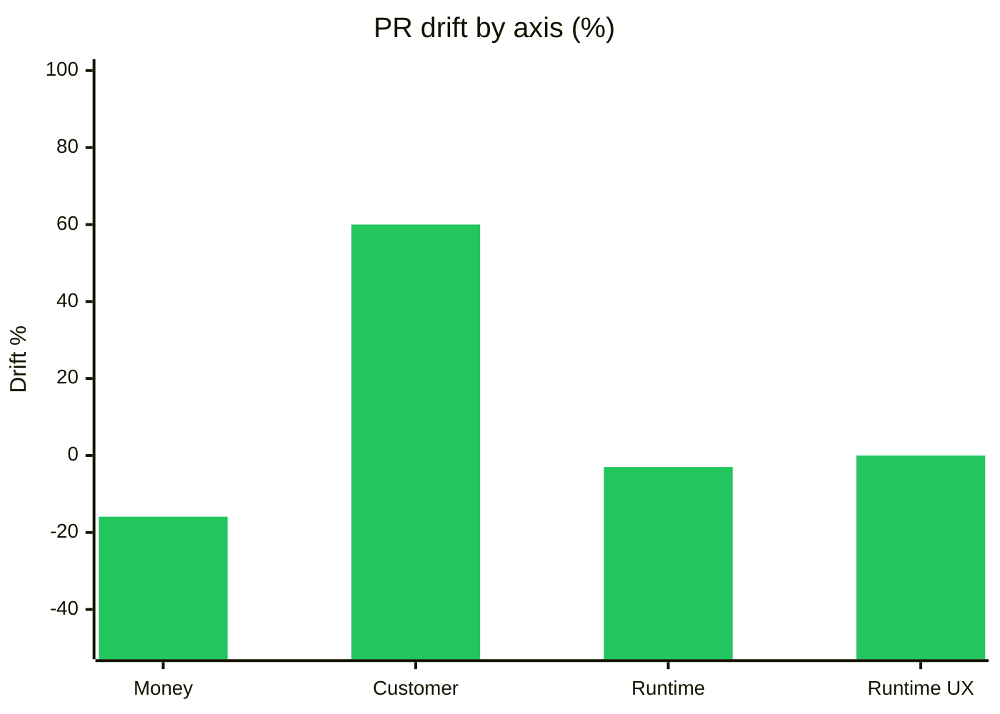
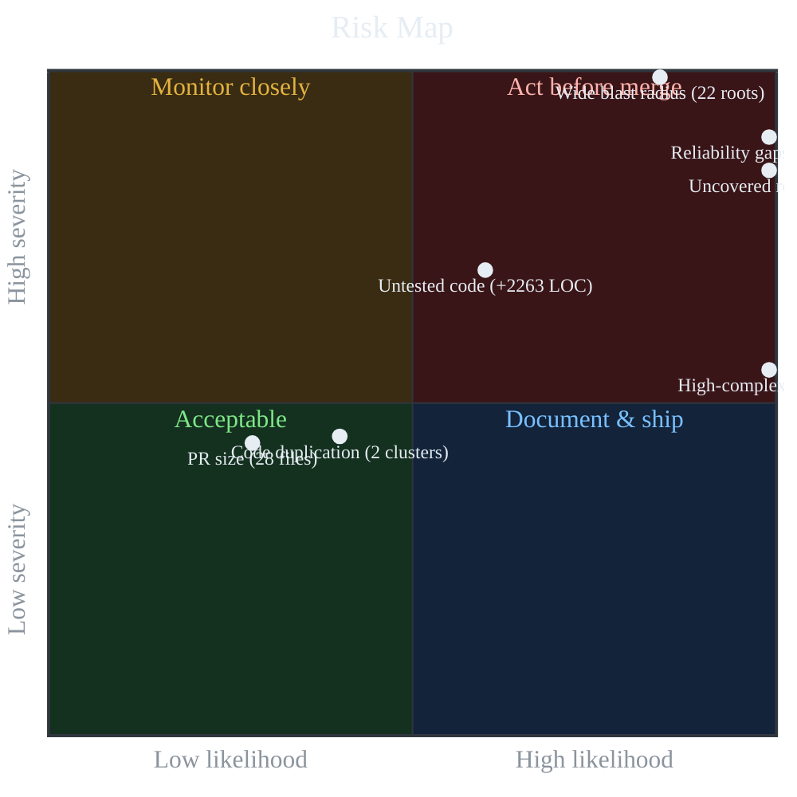
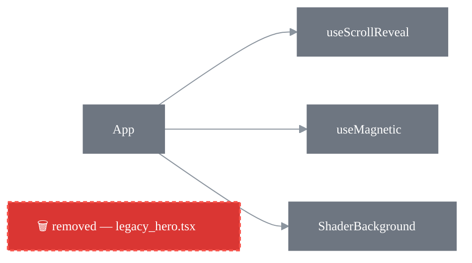
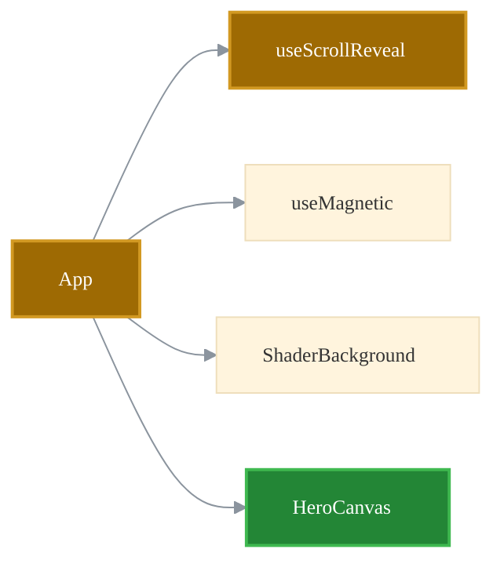
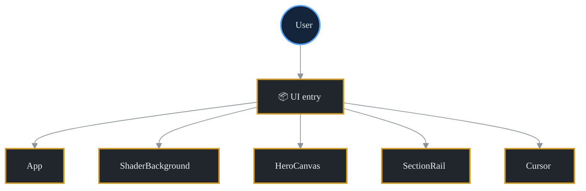
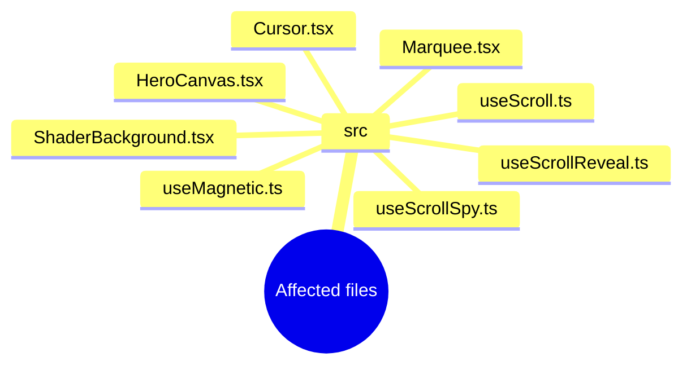

<!-- drift:sticky-comment -->
<!--
  IMPROVED PR COMMENT v7 — GitHub-Flavored-Markdown only (no CSS/JS).
  Built from GFM primitives, everything stays visible:
    1. HTML-table KPI dashboard (semantic: caption + scope)
    2. block-element health bars (always render — no chart dependency)
    3. clickable code permalinks  -> navigable review, not just readable
    4. rendered math blocks        -> real equations for each axis
    5. diff block                  -> the fix shown in red/green
    6. footnotes + nested disclosure (details/summary)
    7. code-snippet permalink      -> real code expands inline in the PR view
    8. since-last-review delta     -> sticky-comment intelligence
    9. legend + methodology        -> self-documenting design system
  v5 design-system pass:
    - composite score now ties to the 4 axes (it's their mean) inside the dashboard card
    - suggestions gain a Priority column (impact != confidence)
    - unified severity palette (red / amber / grey) documented once, reused everywhere
  v6 graph-theming pass:
    - every Mermaid diagram shares one Primer-based theme (mono font, brand line colour)
    - semantic node palette: blue = entry · green = hook · grey = component · muted = before
    - risk-quadrant zones colour-coded: red act / amber monitor / green ok / blue ship
  v7 fidelity + coherence pass:
    - composite status is now amber "mixed" (a +60% gain masking a −15.9% regression is NOT green)
    - magnitude bars use ⅛-block sub-character precision (██▋ for 2.65, not a rounded ███)
  NOTE: permalinks point at blob/main; swap "main" for the PR head SHA to pin exact
        lines AND to make the bare permalink auto-expand into an inline code snippet.
-->

## ▲ Drift review — `feat(ui): modern motion system`

<sub>📍 [`refactorlab/andy`](https://github.com/refactorlab/andy) &nbsp;·&nbsp; sticky review comment — re-rendered on every push &nbsp;·&nbsp; advisory check</sub>

> [!WARNING]
> **Recommend addressing before merge** &nbsp;·&nbsp; advisory, does not fail the check.
> Overall drift **+10.3%** is carried entirely by customer value. Underneath: **💰 Money −15.9%**
> and **⚙️ Runtime −3%** regressed, **+2,263 LOC shipped with 0 tests**, and **1 product-correctness
> issue** was flagged. Ship the UX win — once the regressions and the test gap are triaged.

 &nbsp; &nbsp; &nbsp; &nbsp; &nbsp; &nbsp;

### ✅ Before you merge

- [ ] Fix the product-correctness issue at [`Example.tsx:61`](https://github.com/refactorlab/andy/blob/main/src/components/Example.tsx#L61) (sentinel-value comparison)
- [ ] Add tests — **+2,263 LOC** landed with **0** new test files
- [ ] Triage the **💰 Money −15.9%** and **⚙️ Runtime −3%** regressions, or confirm they're acceptable
- [ ] Remove or wire up 3 dead exports: [`Example`](https://github.com/refactorlab/andy/blob/main/src/components/Example.tsx#L6), [`Hero`](https://github.com/refactorlab/andy/blob/main/src/components/Hero.tsx#L21), [`getInitialTheme`](https://github.com/refactorlab/andy/blob/main/src/lib/theme.ts#L11)
- [ ] Decide on retry / timeout / fallback for the 22 uncovered entry points

> **Merge readiness** &nbsp; `░░░░░░░░░░` &nbsp; **0 / 5** — GitHub tallies the boxes above as you check them off.

---

## 📊 Value card

<table>
<caption>PR value drift — composite &amp; per-axis (Δ% vs. base)</caption>
<tr>
<td colspan="4" align="center"><strong>Composite&nbsp; 🟡 +10.3%</strong> &nbsp;<code>█▊░░░░░░░░</code>&nbsp; <sub>mean of the four axes — <strong>mixed</strong>: a +60% customer gain masks a −15.9% money regression</sub></td>
</tr>
<tr>
<th align="center" width="25%" scope="col">💰 Money</th>
<th align="center" width="25%" scope="col">👥 Customer value</th>
<th align="center" width="25%" scope="col">⚙️ Runtime</th>
<th align="center" width="25%" scope="col">🎨 Runtime UX</th>
</tr>
<tr>
<td align="center"><strong>🔴 −15.9%</strong><br><sub>regressed</sub></td>
<td align="center"><strong>🟢 +60.0%</strong><br><sub>improved</sub></td>
<td align="center"><strong>🔴 −3.0%</strong><br><sub>regressed</sub></td>
<td align="center"><strong>⚪ 0.0%</strong><br><sub>no change</sub></td>
</tr>
<tr>
<td align="center"><code>██▋░░░░░░░</code></td>
<td align="center"><code>██████████</code></td>
<td align="center"><code>▌░░░░░░░░░</code></td>
<td align="center"><code>░░░░░░░░░░</code></td>
</tr>
<tr>
<td align="center"><sub>confidence&nbsp;·&nbsp;<code>low</code></sub></td>
<td align="center"><sub>confidence&nbsp;·&nbsp;<code>medium</code></sub></td>
<td align="center"><sub>confidence&nbsp;·&nbsp;<code>low</code></sub></td>
<td align="center"><sub>confidence&nbsp;·&nbsp;<code>low</code></sub></td>
</tr>
</table>

<sub>Bars show |Δ| relative to the largest axis (Customer, 60%), ⅛-block precision. 🔴 regression · 🟢 improvement · ⚪ flat.</sub>

> 🔁 **Since last review** &nbsp; _First run on this PR — no prior snapshot to diff. Each later push re-renders this sticky comment and fills this line with per-axis deltas (e.g. 💰 ▲ +2.1pp · ⚙️ ▼ −1.0pp)._

> **Bottom line —** mixed. Customer value is up sharply, but Money and Runtime regressed and confidence is `low` on three of four axes. Investigate the regressions before merge.

**Highlights:** ✨ **3** new features &nbsp;·&nbsp; 🐛 **0** bug fixes &nbsp;·&nbsp; 📋 **0** issues resolved &nbsp;·&nbsp; 🧪 **0** new test files

<details>
<summary>📐 How each axis was computed — expand an axis</summary>

<details>
<summary>💰 Money · <code>−15.9%</code> · confidence <code>low</code></summary>

*Tech-debt servicing: bugs + maintenance + AI tokens.*

```math
\Delta\% = \frac{\text{savings} - \text{cost}}{160\,\text{h} \times \$95} \times 100
```

- Tech-debt invested: **−$2,423** &nbsp;·&nbsp; ↳ maintenance −$2,150 (22.6h) &nbsp;·&nbsp; ↳ LLM iteration −$273 (~54.6M tokens)
- Projected savings: **+$0**

**Cost model:** `human_debt (bug_hours[Critical 8 / Important 3 / Minor 0.5] + maintenance [1.5h/finding + 0.01h/LOC]) × $95 + LLM_iteration (6 iters × ~1M tokens × size × debt-mult × $5/1M) + infra/db`. NEW-feature dev-time is **not** modeled — this is the cost of *servicing* what the PR ships.[^money]

**Key inputs:** `cost_usd_total=2422.85` · `human_debt_usd=2149.85` · `maintenance_hours=22.63` · `llm_iteration_cost_usd=273` · `llm_iteration_tokens=54,600,000` · `loc_added=2263` · `loc_deleted=88` · `files_touched=28` · `findings_introduced=0` · `dev_hour_rate_usd=95` · `projected_savings_usd=0`

</details>

<details>
<summary>👥 Customer / user value · <code>+60%</code> · confidence <code>medium</code></summary>

*Time saved + value added per session.*

```math
\Delta\% = \Big(0.6\,\min\!\big(\tfrac{f}{3},1\big) + 0.4\,\min\!\big(\tfrac{i+b}{3},1\big)\Big) \times 100 \times d
```

<sub>where **f** = features, **i** = issues resolved, **b** = bug fixes, **d** = dampening = 1 − 0.15·min(critical, 3).</sub>

- Features delivered: **3** · Issues resolved: 0 · Bugs fixed: 0

**Key inputs:** `features_count=3` · `issues_resolved_count=0` · `bug_fixes_count=0` · `critical_findings=0`[^customer]

</details>

<details>
<summary>⚙️ Software runtime · <code>−3%</code> · confidence <code>low</code></summary>

*Wire size, memory, serialization.*

```math
\Delta\% = \text{prior} - \text{penalty} \qquad (\text{penalty} \le 60)
```

<sub>**prior** from `perf:` commits / net-LOC cleanup; **penalty** sums runtime-degrading findings (N+1, blocking-in-async, ORM/SQL, expensive compute) by tier (Critical 12 / Important 6 / Minor 2).</sub>

- `perf:` commits: 0 · Runtime findings: 0 · Net LOC: **+2,175**

**Key inputs:** `perf_commits=0` · `runtime_regressions=0` · `regression_penalty_pct=0` · `loc_added=2263` · `loc_deleted=88`[^runtime]

</details>

<details>
<summary>🎨 Runtime UX · <code>0%</code> · confidence <code>low</code></summary>

*Dev / debugging experience time delta.*

```math
\Delta\% = \min\!\big(60,\ 5t + 3b + 4d\big)
```

<sub>where **t** = new test files, **b** = bug fixes, **d** = docs commits. Confidence held `low` when a Critical finding ships with zero new tests.</sub>

- New tests: 0 · Docs commits: 0

**Key inputs:** `new_test_files=0` · `bug_fixes=0` · `docs_commits=0` · `critical_findings=0`[^ux]

</details>

</details>

<details>
<summary>📈 Bar-chart view</summary>



</details>

---

## ⚠️ Suggestions (4)

> [!CAUTION]
> **1 product-correctness issue** was flagged. It's surfaced as a warning and does **not** fail the check — but it should be resolved before merge.

<sub>**Priority reflects impact, not certainty** — a 100%-confident dead-code removal is still low-priority cleanup; the 75% product-correctness finding matters more.</sub>

| Priority | Finding | Location | Confidence |
|:--:|---|---|---:|
| 🟡 Medium | 🅑 Product correctness | [`Example.tsx:61`](https://github.com/refactorlab/andy/blob/main/src/components/Example.tsx#L61) | 75% |
| ⚪ Low | 🅐 Dead code | [`Example.tsx:6`](https://github.com/refactorlab/andy/blob/main/src/components/Example.tsx#L6) | 100% |
| ⚪ Low | 🅐 Dead code | [`Hero.tsx:21`](https://github.com/refactorlab/andy/blob/main/src/components/Hero.tsx#L21) | 100% |
| ⚪ Low | 🅐 Dead code | [`theme.ts:11`](https://github.com/refactorlab/andy/blob/main/src/lib/theme.ts#L11) | 100% |

<details>
<summary>🅑 <strong>Product correctness</strong> · <code>src/components/Example.tsx:61</code> · 75%</summary>

Sentinel comparison at [`src/components/Example.tsx:61`](https://github.com/refactorlab/andy/blob/main/src/components/Example.tsx#L61). Using `0` / `-1` / `""` / `null` to mean "missing" makes valid zero/empty cases ambiguous and tends to leak into downstream code. Idiomatic fix: an `Option` / `Result` / `Maybe` type (or the language's null-coalescing operator).

**Current code** — a bare commit-SHA permalink auto-expands into a rendered, syntax-highlighted snippet right here in the PR (shown as a link until then):

https://github.com/refactorlab/andy/blob/main/src/components/Example.tsx#L58-L64

**Suggested fix:**

```diff
  // Illustrative idiom (not the exact diff)
- const idx = items.indexOf(target)   // -1 means "missing"
- if (idx !== -1) select(items[idx])
+ const found = items.find((it) => it.id === target)
+ if (found !== undefined) select(found)
```

**Reference:** [Wikipedia — Sentinel value (pitfalls)](https://en.wikipedia.org/wiki/Sentinel_value)

</details>

<details>
<summary>🅐 <strong>Optimization</strong> · dead code · <code>src/components/Example.tsx:6</code> · 100%</summary>

[`Example`](https://github.com/refactorlab/andy/blob/main/src/components/Example.tsx#L6) is reachable by zero callers but lives in a file this PR touched. Either wire it up to an entry point or delete it.

**Reference:** [Refactoring.guru — Dead code smell](https://refactoring.guru/smells/dead-code)

</details>

<details>
<summary>🅐 <strong>Optimization</strong> · dead code · <code>src/components/Hero.tsx:21</code> · 100%</summary>

[`Hero`](https://github.com/refactorlab/andy/blob/main/src/components/Hero.tsx#L21) is reachable by zero callers but lives in a file this PR touched. Either wire it up to an entry point or delete it.

**Reference:** [Refactoring.guru — Dead code smell](https://refactoring.guru/smells/dead-code)

</details>

<details>
<summary>🅐 <strong>Optimization</strong> · dead code · <code>src/lib/theme.ts:11</code> · 100%</summary>

[`getInitialTheme`](https://github.com/refactorlab/andy/blob/main/src/lib/theme.ts#L11) is reachable by zero callers but lives in a file this PR touched. Either wire it up to an entry point or delete it.

**Reference:** [Refactoring.guru — Dead code smell](https://refactoring.guru/smells/dead-code)

</details>

---

## 🛰 Risks

**5 of 7** risks land in *Act before merge*. Highest-priority first:

| Risk | Likelihood | Severity | Quadrant |
|---|---:|---:|---|
| Reliability gaps · 22 roots lack retry/timeout/fallback | 1.00 | 0.90 | 🔴 Act before merge |
| Wide blast radius · 22 roots affected | 0.84 | 1.00 | 🔴 Act before merge |
| Uncovered roots · 22 (`App`, `<module>` + 20 more) | 1.00 | 0.85 | 🔴 Act before merge |
| Untested code · +2,263 LOC, no test files | 0.60 | 0.70 | 🔴 Act before merge |
| High-complexity functions · 6 | 1.00 | 0.55 | 🔴 Act before merge |
| Code duplication · 2 clusters | 0.40 | 0.45 | 🟢 Acceptable |
| PR size · 28 files | 0.28 | 0.44 | 🟢 Acceptable |

<details>
<summary>🗺 Risk quadrant map (severity ↑ × likelihood →)</summary>



</details>

---

## 🏗 Architecture & reach

**22** entry points reach changes in this PR. The files most callers depend on:

| File | Roots reaching it |
|---|---:|
| [`src/components/ShaderBackground.tsx`](https://github.com/refactorlab/andy/blob/main/src/components/ShaderBackground.tsx) | 40 |
| [`src/components/HeroCanvas.tsx`](https://github.com/refactorlab/andy/blob/main/src/components/HeroCanvas.tsx) | 38 |
| [`src/lib/useScrollSpy.ts`](https://github.com/refactorlab/andy/blob/main/src/lib/useScrollSpy.ts) | 21 |
| [`src/components/Marquee.tsx`](https://github.com/refactorlab/andy/blob/main/src/components/Marquee.tsx) | 18 |
| [`src/lib/useMagnetic.ts`](https://github.com/refactorlab/andy/blob/main/src/lib/useMagnetic.ts) | 17 |
| [`src/lib/useScroll.ts`](https://github.com/refactorlab/andy/blob/main/src/lib/useScroll.ts) | 17 |
| [`src/lib/useScrollReveal.ts`](https://github.com/refactorlab/andy/blob/main/src/lib/useScrollReveal.ts) | 17 |
| [`src/components/Cursor.tsx`](https://github.com/refactorlab/andy/blob/main/src/components/Cursor.tsx) | 16 |

> **2 changed files are unreachable** from any entry point — likely dead code, config, or tests: [`Example.tsx`](https://github.com/refactorlab/andy/blob/main/src/components/Example.tsx), [`Hero.tsx`](https://github.com/refactorlab/andy/blob/main/src/components/Hero.tsx). (These match the dead-code suggestions above.)

<details>
<summary>🧭 Architecture flow diagram — before vs after</summary>

> **🔴 BEFORE** reconstructs the call graph as it existed pre-PR (`status=added`/`copied` files skipped, `status=removed` files appear as red `🗑 removed` placeholder cards, renamed files shown under their **old** name). **🟢 AFTER** shows the current call graph with file-status colouring (🟩 added · 🟧 modified/renamed · ⚪ unchanged).
> Nodes labelled `‹anonymous@N›` are anonymous functions/arrow callbacks the profiler couldn't name; treat them as call sites within the labelled module.

**🔴 BEFORE — what the code was:**



**🟢 AFTER — what the code is now:**



[Mermaid flowchart reference](https://mermaid.js.org/syntax/flowchart.html)

</details>

<details>
<summary>🧠 Business-logic reach diagram</summary>



</details>

<details>
<summary>📦 Data structures touched (12)</summary>

| Name | Kind | Language | Methods in scope |
|---|:--:|---|---:|
| `<anonymous@17>` | modified | typescript | 34 |
| `<anonymous@94>` | modified | typescript | 31 |
| `<anonymous@11>` | modified | typescript | 15 |
| `<anonymous@18>` | modified | typescript | 13 |
| `<anonymous@13>` | modified | typescript | 12 |
| `<anonymous@17>` | modified | typescript | 12 |
| `<anonymous@20>` | modified | typescript | 12 |
| `<anonymous@11>` | modified | typescript | 11 |
| `<anonymous@20>` | modified | typescript | 6 |
| `<anonymous@21>` | modified | typescript | 6 |
| `<anonymous@23>` | modified | typescript | 6 |
| `<anonymous@12>` | modified | typescript | 5 |

</details>

<details>
<summary>🗂 Key files — hot-touch mindmap</summary>



</details>

---

## 🧪 Extended findings

<details>
<summary>Duplication, uncovered entry points, reliability gaps &amp; tech debt</summary>

### 🧬 Duplication (2 clusters)

- `start` in [`HeroCanvas.tsx`](https://github.com/refactorlab/andy/blob/main/src/components/HeroCanvas.tsx) ↔ `start` in [`ShaderBackground.tsx`](https://github.com/refactorlab/andy/blob/main/src/components/ShaderBackground.tsx)
- `stop` in [`HeroCanvas.tsx`](https://github.com/refactorlab/andy/blob/main/src/components/HeroCanvas.tsx) ↔ `stop` in [`ShaderBackground.tsx`](https://github.com/refactorlab/andy/blob/main/src/components/ShaderBackground.tsx)

### 🧪 Uncovered entry points (22)

No test file reaches these in the call graph:

`App` · `<module>` · `ShaderBackground` · `HeroCanvas` · `SectionRail` · `Cursor` · `Marquee` · `useScroll` · `TiltCard` · `ScrambleText` · *…+12 more*

### 🛡️ Reliability gaps (22)

These entry points lack retry / timeout / circuit / fallback markers:

`App` · `<module>` · `ShaderBackground` · `HeroCanvas` · `SectionRail` · `Cursor` · `Marquee` · `useScroll` · `TiltCard` · `ScrambleText` · *…+12 more*

### ⚠️ Tech-debt findings

- **6** high-complexity functions (threshold 10)
- **8** long functions (threshold 80 LOC)

</details>

<details>
<summary>🔖 Legend &amp; methodology</summary>

| Symbol | Meaning |
|:--:|---|
| 🔴 / 🟢 / ⚪ | Axis direction — regression / improvement / no change |
| `██▋░░` | Magnitude bar — \|Δ\| relative to the largest axis, ⅛-block precision |
| 🅐 / 🅑 | Finding class — 🅐 optimization · 🅑 product correctness |
| 🔴 / 🟡 / ⚪ | **Priority** — high (act now) / medium / low (cleanup); reflects *impact*, **not** confidence |
| `low` / `medium` / `high` | Model **confidence** in the estimate (independent of priority) |
| 🔴 Act before merge / 🟢 Acceptable | Risk quadrant — severity × likelihood |

**Methodology.** Each axis's Δ% is computed against the merge base (formulas above). Thresholds: complexity > 10, long function > 80 LOC. A suggestion is surfaced only at confidence ≥ 75% with a supporting reference. Findings are **advisory** and never fail the check. Counts and reach come from a static call-graph; nodes the profiler can't name appear as `‹anonymous@N›`.

</details>

---

<sub>Posted by <a href="https://drift.dev">Drift</a> · static-analysis report from <code>drift-static-profiler</code> v0.6.3 · 🔊 <a href="https://github.com/refactorlab/andy/actions/runs/26524874870/artifacts/7246155704">Listen to the spoken summary</a> (Piper TTS · WAV)</sub>

<details>
<summary><sub>📎 Scan artifacts (JSON)</sub></summary>

<sub><a href="https://github.com/refactorlab/andy/actions/runs/26524874870/artifacts/7246155801">pr-scan.json</a> · <a href="https://github.com/refactorlab/andy/actions/runs/26524874870/artifacts/7246155802">pr-scan-context.json</a> — machine-readable scanner report + scan context. Sign in to GitHub to download.</sub>

</details>

> **Scan-artifacts accordion** (closed by default, smallest text). Two machine-readable JSON files this run uploaded as non-zipped artifacts, for an agent picking up the handoff: `pr-scan.json` is the **complete** (uncapped) scanner report — unlike the size-capped comment above, it carries every suggestion — and `pr-scan-context.json` bundles the scan's *context* (PR identity, the exact diff scope, the merge-base, scanner identity, run pointers): "what did Drift look at", complementing the report's "what did Drift find". Both links 404 for signed-out viewers (GitHub gates artifact downloads even on public repos), hence the explicit login note.

[^money]: **Money — sources:** [Testomat: real cost of software bugs](https://testomat.io/blog/software-bug-cost/) · [Sonar: cost of technical debt](https://www.sonarsource.com/blog/new-research-from-sonar-on-cost-of-technical-debt) · [HiBob: fully-burdened labor rate](https://www.hibob.com/financial-metrics/fully-burdened-labor-rate/) · [BenchLM: LLM token pricing 2026](https://benchlm.ai/llm-pricing) · [Stanford Digital Economy Lab: how AI agents spend tokens](https://digitaleconomy.stanford.edu/news/how-are-ai-agents-spending-your-tokens/)

[^customer]: **Customer — sources:** [Conventional Commits v1.0.0](https://www.conventionalcommits.org/en/v1.0.0/) · [GitHub: linking PRs to issues](https://docs.github.com/en/issues/tracking-your-work-with-issues/linking-a-pull-request-to-an-issue)

[^runtime]: **Runtime — sources:** [CNCF Observability Whitepaper](https://github.com/cncf/tag-observability/blob/main/whitepaper.md) · [The Twelve-Factor App](https://12factor.net/) · [Google SRE Book: monitoring](https://sre.google/sre-book/monitoring-distributed-systems/)

[^ux]: **Runtime UX — sources:** [12-Factor App: Logs](https://12factor.net/logs) · [Google SRE Book: being on-call](https://sre.google/sre-book/being-on-call/) · [Conventional Commits (`docs:` prefix)](https://www.conventionalcommits.org/en/v1.0.0/)
